# Pitstop Application

Application Architecture

<div align="center">
  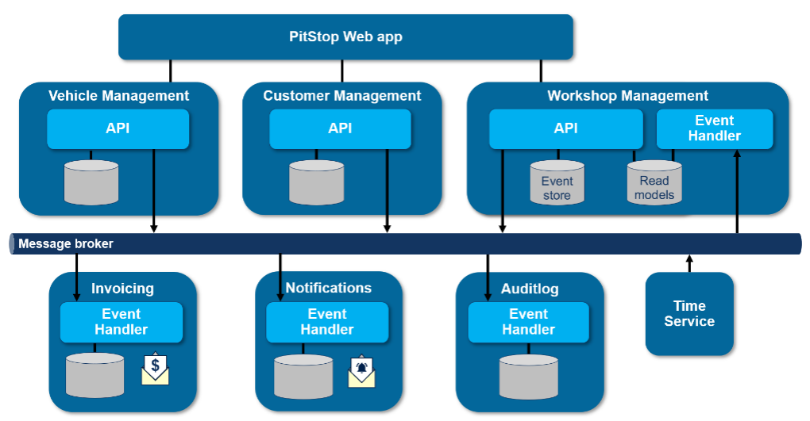
</div>

## Introduction
The Pitstop application is a service management system implemented using a microservices architecture. Jenkins CI/CD pipeline is utilized to automate the development and deployment processes. The application includes tools such as Trivy and SonarQube for code scanning, Docker for building images, Terraform for creating an AWS EKS cluster, and Prometheus and Grafana for monitoring the application.

## Technologies Used
- **Jenkins**: CI/CD pipeline
- **Trivy**: Code and Docker image scanning
- **SonarQube**: Code quality analysis
- **Docker**: Building and managing Docker images
- **Terraform**: Infrastructure management
- **AWS EKS**: Deploying applications on Kubernetes
- **Prometheus**: Application monitoring
- **Grafana**: Data visualization for monitoring
- **Email Notifications**: Sending notifications via email


<div align="center">
  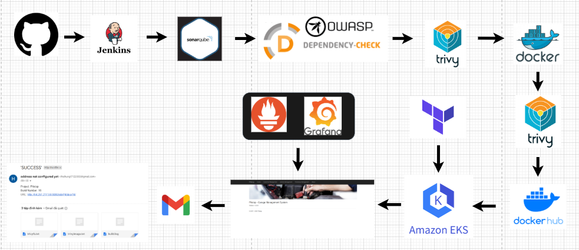
  </a>
</div>
<br />

<div align="center">
  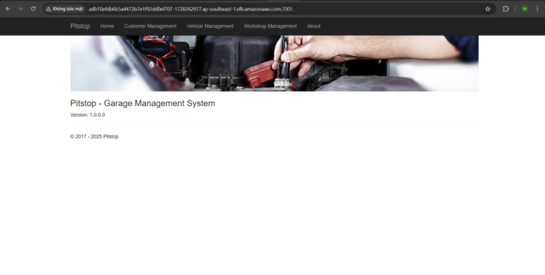
</div>

<div align="center">
  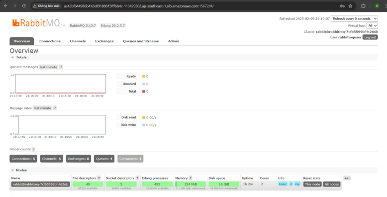
</div>

<div align="center">
  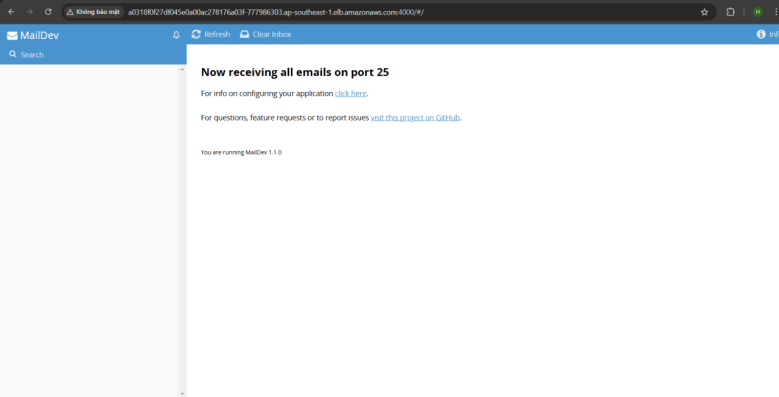
</div>

<div align="center">
  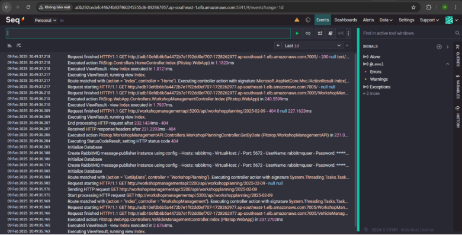
</div>


### **CI/CD Pipeline in Jenkins**

**Pipeline Stage View:**

<div align="center">
  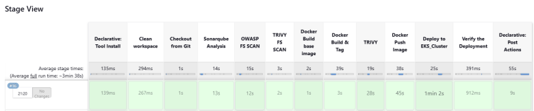
</div>

**OWASP Dependency-Check:**

Dependency-Check Trend

<div align="center">
  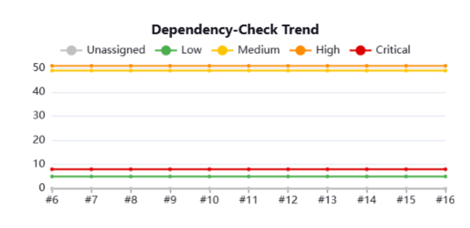
</div>

Dependency-Check Result

<div align="center">
  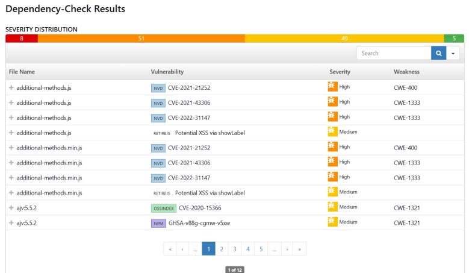
</div>


**Configure CI/CD Pipeline in Jenkins:**

```groovy
pipeline{
    agent any
    tools{
        jdk 'jdk17'
    }
    environment {
        SCANNER_HOME=tool 'sonar-scanner'
    }
    stages {
        stage('Clean workspace'){
            steps{
                cleanWs()
            }
        }
        stage('Checkout from Git'){
            steps{
                git branch: 'main', url: 'https://github.com/thaihung202/Pitstop-app.git'
            }
        }
        stage("Sonarqube Analysis "){
            steps{
                withSonarQubeEnv('sonar-server') {
                    sh ''' $SCANNER_HOME/bin/sonar-scanner -Dsonar.projectName=Pitstop \
                    -Dsonar.projectKey=Pitstop '''
                }
            }
        }
        //stage("Quality gate"){
           //steps {
               // script {
                   // waitForQualityGate abortPipeline: false, credentialsId: 'Sonar-token' 
                //}
           // } 
        //}

        stage('OWASP FS SCAN') {
            steps {
                dependencyCheck additionalArguments: '--scan ./', odcInstallation: 'DP-Check'
                dependencyCheckPublisher pattern: '**/dependency-check-report.xml'
            }
        }
        stage('TRIVY FS SCAN') {
            steps {
                sh "trivy fs . > trivyfs.txt"
            }
        }
        stage("Docker Build base image"){
            steps{
                sh """
                docker volume create --name=sqlserverdata
                docker volume create --name=rabbitmqdata
                docker build -t pitstop-dotnet-sdk-base:1.0 -f src/dotnet-sdk-base-dockerfile ./src
                docker build -t pitstop-dotnet-runtime-base:1.0 -f src/dotnet-runtime-base-dockerfile ./src
                docker build -t pitstop-dotnet-aspnet-base:1.0 -f src/dotnet-aspnet-base-dockerfile ./src
                """
            }
        }        
        stage('Docker Build & Tag') {
            steps {
                script {
                    withDockerRegistry(credentialsId: 'docker', toolName: 'docker') {
                        sh """
                        docker build -t thaihung17/customermanagementapi:1.0 ./src/CustomerManagementAPI
                        docker build -t thaihung17/webapp:1.0 ./src/WebApp
                        docker build -t thaihung17/workshopmanagementeventhandler:1.0 ./src/WorkshopManagementEventHandler
                        docker build -t thaihung17/timeservice:1.0 ./src/TimeService
                        docker build -t thaihung17/notificationservice:1.0 ./src/NotificationService
                        docker build -t thaihung17/invoiceservice:1.0 ./src/InvoiceService
                        docker build -t thaihung17/auditlogservice:1.0 ./src/AuditlogService
                        docker build -t thaihung17/workshopmanagementapi:1.0 ./src/WorkshopManagementAPI
                        docker build -t thaihung17/vehiclemanagementapi:1.0 ./src/VehicleManagementAPI
                        """
                    }
                }
            }
        }
        stage("TRIVY") {
            steps {
                script {
                    def images = [
                        "thaihung17/customermanagementapi:1.0",
                        "thaihung17/webapp:1.0",
                        "thaihung17/workshopmanagementeventhandler:1.0",
                        "thaihung17/timeservice:1.0",
                        "thaihung17/notificationservice:1.0",
                        "thaihung17/invoiceservice:1.0",
                        "thaihung17/auditlogservice:1.0",
                        "thaihung17/workshopmanagementapi:1.0",
                        "thaihung17/vehiclemanagementapi:1.0"
                    ]
                    sh "echo 'Trivy Scan Results:' > trivyimage.txt"
                    images.each { image ->
                        sh "trivy image ${image} >> trivyimage.txt"
                    }
                }
            }
        }
        stage('Docker Push Image') {
            steps {
                script {
                    withDockerRegistry(credentialsId: 'docker', toolName: 'docker') {
                        sh """
                        docker push thaihung17/customermanagementapi:1.0
                        docker push thaihung17/webapp:1.0
                        docker push thaihung17/workshopmanagementeventhandler:1.0
                        docker push thaihung17/timeservice:1.0
                        docker push thaihung17/notificationservice:1.0
                        docker push thaihung17/invoiceservice:1.0
                        docker push thaihung17/auditlogservice:1.0
                        docker push thaihung17/workshopmanagementapi:1.0
                        docker push thaihung17/vehiclemanagementapi:1.0
                        """
                    }
                }
            }
        }
        stage('Deploy to EKS_Cluster') {
            steps {
                withKubeConfig(caCertificate: '', clusterName: 'Pitstop-cluster', contextName: '', credentialsId: 'k8s-cred', namespace: 'pitstop', restrictKubeConfigAccess: false, serverUrl: 'https://3F6DEB8E29B8B2ABE46DFB241488A1E7.gr7.ap-southeast-1.eks.amazonaws.com') {
                    sh """
                    kubectl apply \
                        -f src/k8s/pitstop-namespace.yaml \
                        -f src/k8s/rabbitmq.yaml \
                        -f src/k8s/logserver.yaml \
                        -f src/k8s/sqlserver.yaml \
                        -f src/k8s/mailserver.yaml \
                        -f src/k8s/invoiceservice.yaml \
                        -f src/k8s/timeservice.yaml \
                        -f src/k8s/notificationservice.yaml \
                        -f src/k8s/workshopmanagementeventhandler.yaml \
                        -f src/k8s/auditlogservice.yaml \
                        -f src/k8s/customermanagementapi-v1.yaml \
                        -f src/k8s/customermanagementapi-svc.yaml \
                        -f src/k8s/vehiclemanagementapi.yaml \
                        -f src/k8s/workshopmanagementapi.yaml \
                        -f src/k8s/webapp.yaml
                    """
                    sleep 60 
                }
            }
        }
        stage('Verify the Deployment') {
            steps {
                withKubeConfig(caCertificate: '', clusterName: 'Pitstop-cluster', contextName: '', credentialsId: 'k8s-cred', namespace: 'pitstop', restrictKubeConfigAccess: false, serverUrl: 'https://3F6DEB8E29B8B2ABE46DFB241488A1E7.gr7.ap-southeast-1.eks.amazonaws.com') {
                    sh "kubectl get nodes" 
                    sh "kubectl get pods"
                    sh "kubectl get svc" 
                }
            }
        }
    }
    post {
     always {
        emailext attachLog: true,
            subject: "'${currentBuild.result}'",
            body: "Project: ${env.JOB_NAME}<br/>" +
                "Build Number: ${env.BUILD_NUMBER}<br/>" +
                "URL: ${env.BUILD_URL}<br/>",
            to: 'thaihung17122003@gmail.com',                                
            attachmentsPattern: 'trivyfs.txt,trivyimage.txt'
        }
    }
}
```
**Plugins in Jenkins:**

1 Eclipse Temurin Installer 

2 SonarQube Scanner 

3 Config File Provider

4 Kubernetes

5 Kubernetes Credentials

6 Kubernetes CLI

7 Kubernetes Client API

8 Docker Pineline

9 Docker 

10 Docker API

11 Docker Commons

12 Pineline: Stage View

13 OWASP Dependency-Check

14 Email Extension Plugin


### **SonarQube and Trivy scan for vulnerabilities**

<div align="center">
  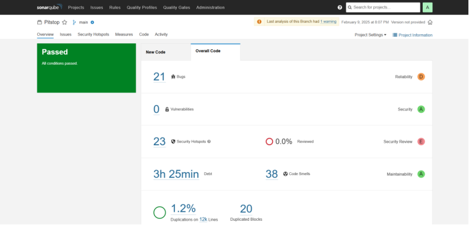
</div>

### **Create EKS Cluster with Terraform**

<div align="center">
  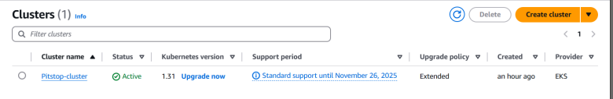
</div>

<div align="center">
  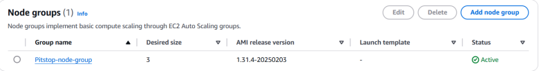
</div>


### **Monitoring with prometheus and grafana**

Prometheus

<div align="center">
  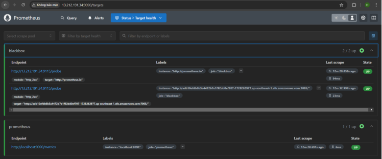
</div>

Grafana

<div align="center">
  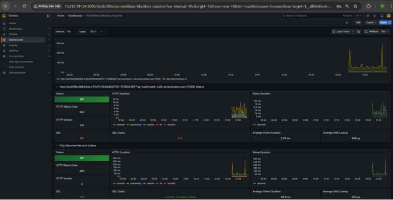
</div>

Blackbox Exporter

<div align="center">
  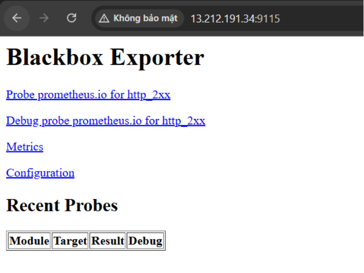
</div>

### **Send Notification to email**

<div align="center">
  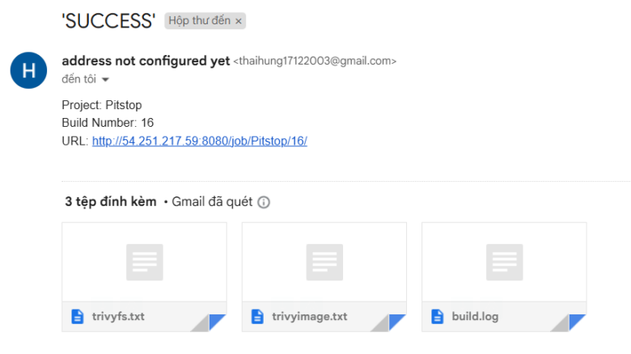
</div>


